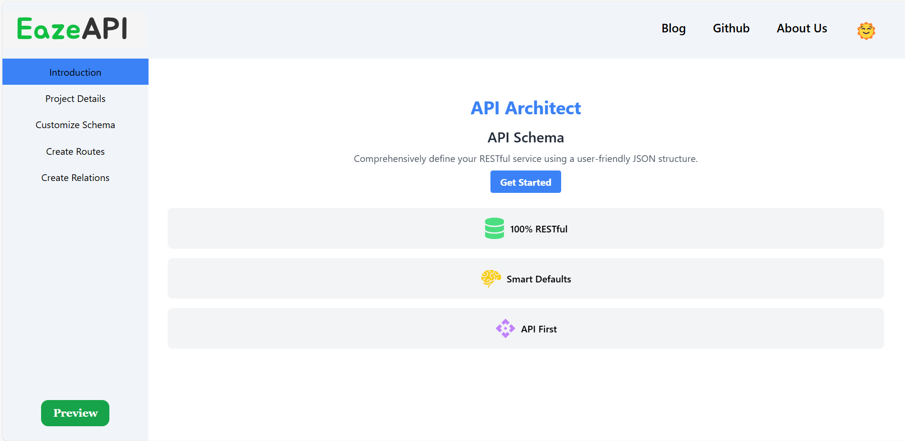
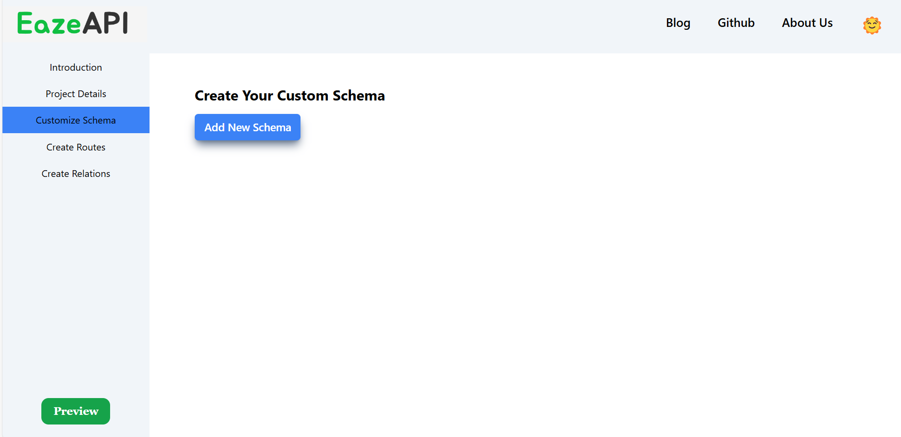
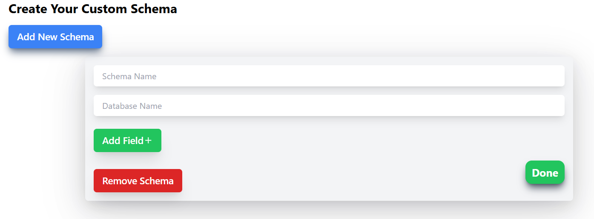
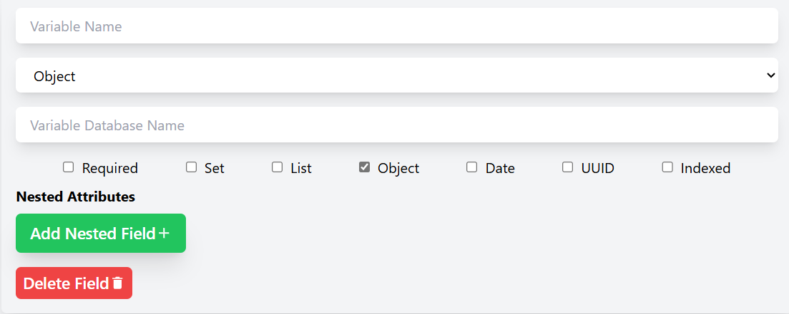
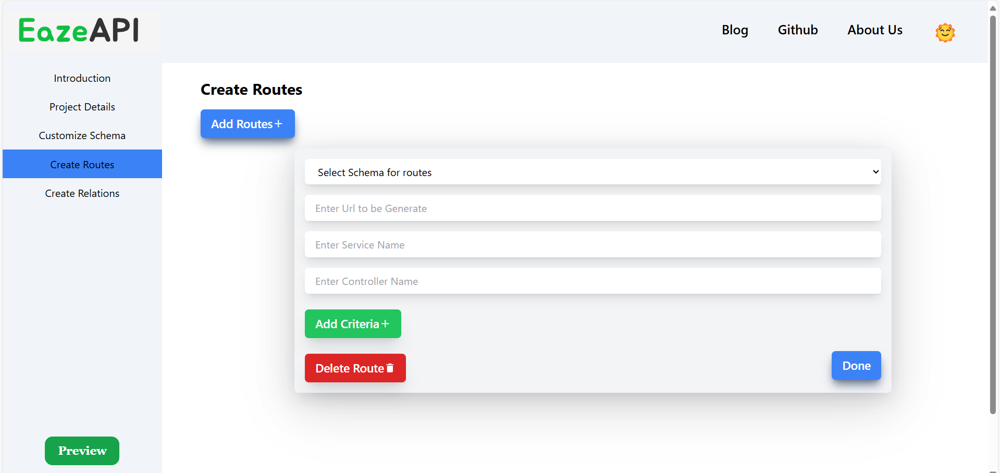
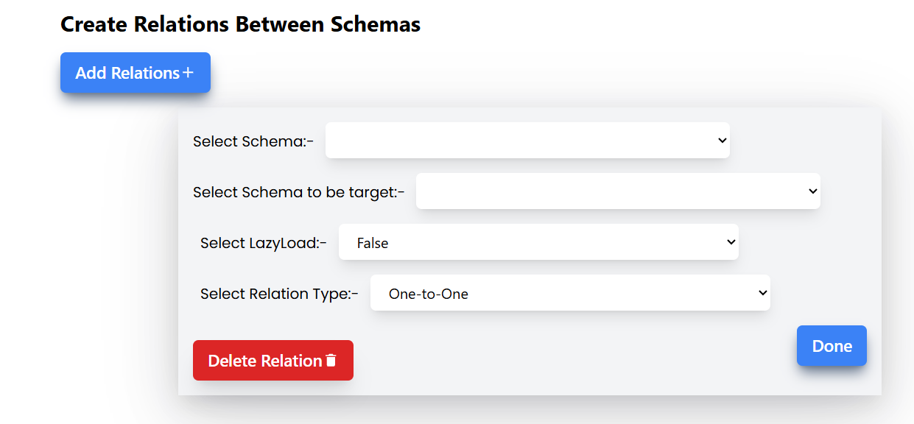

## RESTGenius

The Smart API Generation Technology

**Introduction:-**

EazeApi is designed for developers who spend too much time creating APIs. With this platform, you can easily create or customize your own API code, including schema creation, selecting service functions, setting up advanced routes, and configuring a customized MongoDB setup. EazeApi also benefits frontend developers by integrating Swagger API documentation.

**Benefits:-**

1. **Streamlined API Generation**: Simplifies the API creation process, ensuring a structured and efficient workflow for developers.

2. **Comprehensive Frontend and Backend Support**: Provides both backend functionality and a frontend interface with Swagger UI, making API testing and documentation straightforward.

3. **No Prior Knowledge Required**: Designed to be accessible to all users, regardless of technical background, enabling quick adoption and ease of use.

4. **User-Friendly Interface**: Intuitive design ensures a smooth user experience, minimizing learning curves and maximizing productivity.

5. **Developer-Centric Design**: Tailored for both beginner and experienced engineers, making it adaptable for developers at all skill levels.

6. **Scalable for Any Project Size**: Suitable for projects of any scale, from small applications to large-scale enterprise systems.

7. **Automated Documentation**: Automatically generates API documentation, reducing the need for manual documentation and enhancing clarity.

8. **Customizable API Relationships**: Easily create complex relationships between schemas, allowing flexibility and control in API design.

9. **Optimized for Speed and Efficiency**: Reduces development time by automating repetitive tasks, enabling faster delivery and iteration cycles.

10. **Supports Modern Standards**: Keeps up with best practices and standards in API design, ensuring robust and reliable APIs.

Here's an enhanced version of the **How to Use** section to make it clearer and more engaging:

---

### How to Use:

**_Step 1_**: **Access Our Services**  
Navigate to our website, and go to the services section to get started.

---

**_Step 2_**: **Get Started**  
On the next page, click the **Get Started** button to begin customizing your APIs.

---

**_Step 3_**: **Enter Project Details**  
After clicking **Get Started**, you’ll see a project details form. Fill in the required fields, including your project name, MongoDB URI (optional), port (optional), and ORM (currently supporting Java - Spring).

---

**_Step 4_**: **Customize Schemas**  
Click **Next** to open the schema customization page. Here, you can add new schemas by clicking the **Add New Schema** button. A form like this will appear:

- Enter the schema name and database name.
- Click **Add Field** to add individual fields with properties like entity name, type, variable name, and additional options.

If the **Entity Type** is set to **Object**, you'll see an option to add nested fields for embedded mapping:

Once you're satisfied with the schema, click **Done** to save it.

---

**_Step 5_**: **Create Routes**  
After customizing schemas, you can dynamically create routes to add functionality to your API. The route creation page will look like this:

Simply follow the page instructions to set up and configure routes as needed.

---

**_Step 6_**: **Define Relations**  
You can also establish relationships between multiple schemas. The relations page is intuitive and looks like this:

---

**_Step 7_**: **Preview and Export**  
Finally, click the **Preview** button in the sidebar to review the customized code. From here, you can either copy or download the files and folders for your project.

---
